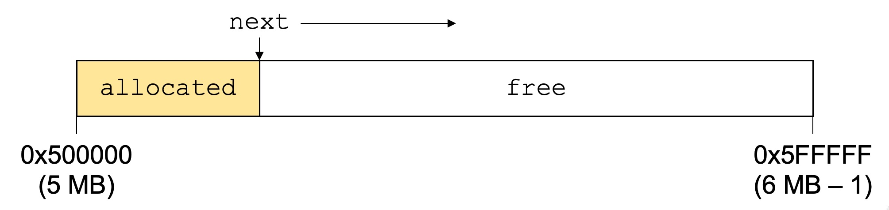
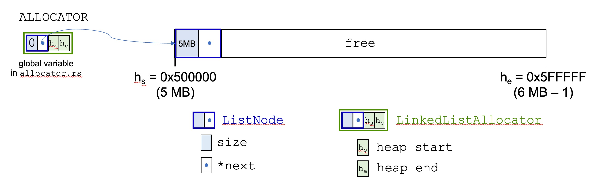
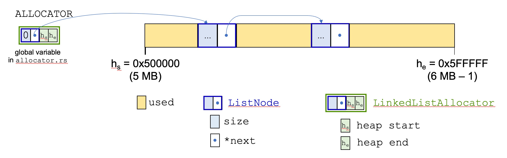
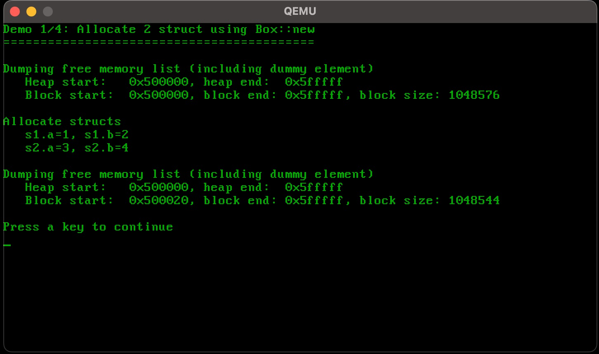
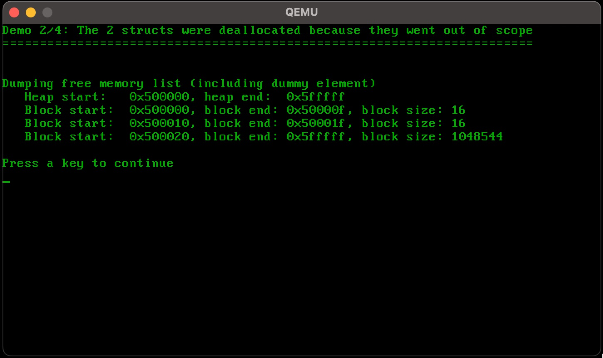
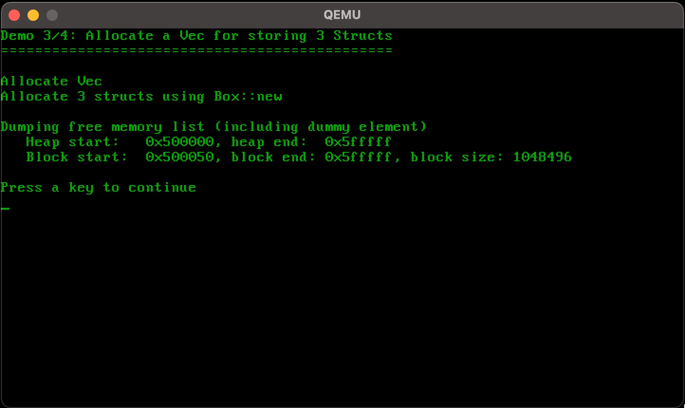
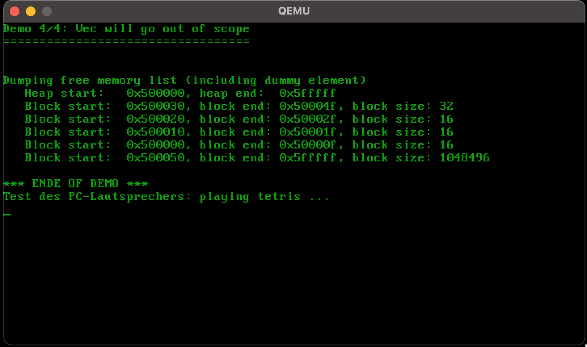
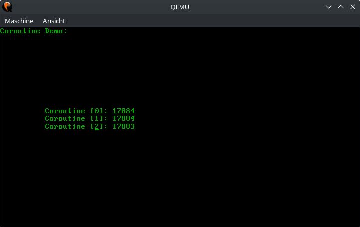
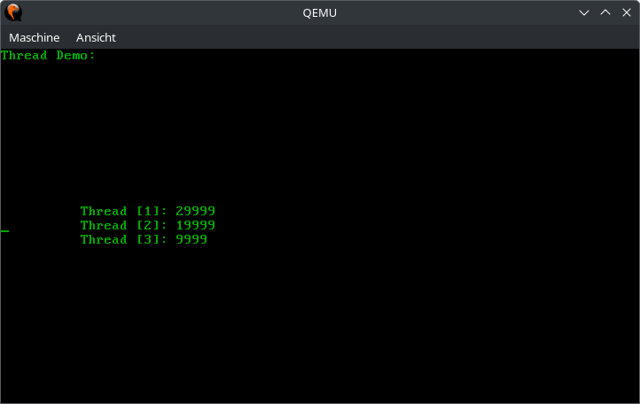
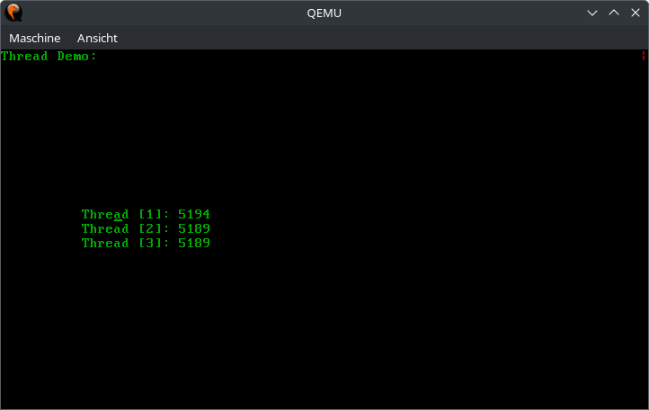

# Aufgabe 1: Ein-/Ausgabe

Der Quellcode zum Betriebssystem befindet sich im Unterordner [os](os/). Dort finden Sie auch eine README-Datei mit Anleitungen zum Kompilieren und Starten von hhuTOS.

## Lernziele
1. Kennenlernen der Entwicklungsumgebung
2. Einarbeiten in die Programmiersprache Rust
3. Hardwarenahe Programmierung: CGA-Bildschirm und Tastatur


## A1.1: CGA-Bildschirm
Für Testausgaben und zur Erleichterung der Fehlersuche soll das Betriebssystem zunächst Ausgabefunktionen für den Textbildschirm erhalten. Die Funktionsfähigkeit soll mit Hilfe eines aussagefähigen Testprogramms gezeigt werden, siehe Bildschirmfoto unten.

Dazu soll in `startup.rs` in der Einstiegsfunktion `startup` die Makros `print!` und `println!` für verschieden formatierte Ausgaben, wie in Rust üblich, genutzt werden. Damit die Ausgabe-Makros in allen Modulen funktionieren wurde in `cga_print.rs` ein globaler statischer `Writer`
definiert. Dieser wird in den vorgegebenen Makros automatisch benutzt.

In folgenden Dateien müssen Quelltexte einfügt werden: `startup.rs`, `user/text_demo.rs` und
`devices/cga.rs`

*Beachten Sie die Kommentare im Quelltext der Vorgabe, sowie die Datei* `CGA-slides.pdf`

### Beispielausgaben


## A1.2: Tastatur
Damit eine Interaktion mit dem Betriebssystem möglich wird benötigen wir einen Tastatur-Treiber. In dieser Aufgabe verwenden wir die Tastatur ohne Interrupts. In main soll die Tastatur in einer Endlos-Schleife abgefragt werden und die Eingaben auf dem CGA-Bildschirm zur Kontrolle ausgegeben werden. 

Beginnen Sie mit der Funktion `key_hit`:
- Prüfen Sie zunächst in einer Schleife, ob ein Datenbyte von der Tastatur vorliegt. Hierzu muss im Control-Port geprüft werden, ob das Bit `OUTB` gesetzt ist.
- Lesen Sie anschließend das Datenbyte über den Daten-Port ein und speichern Sie das gelesene Byte in der gegebenen Variable code.
- Verwenden Sie die vorgegeben Funktion `key_decoded` um jeweils ein gelesenes Datenbyte zu übersetzen. Jedoch müssen Sie zuvor prüfen, ob das Datenbyte nicht von einer PS/2 Maus stammt. Dies wird über das Bit `AUXB` im Control-Register angezeigt. Beim Aufruf von `key_decoded` müssen Sie das das Datenbyte nicht übergeben, dies ist bereits in der Variablen `code` gespeichert.
- Wenn `key_decoded` true zurückgibt wurde eine Taste komplett dekodiert und in der Variablen `gather` gespeichert. Geben Sie in diesem Fall `gather` (Typ `Key`) zurück oder ansonsten `invalid`. 

Danach können folgende Funktionen implementiert werden: `set_repeate_rate` und `set_led`. Beide Funktion können, müssen aber nicht implementiert werden.

Namen von benötigten Variablen und Konstanten:
- Control-Port: `KBD_CTRL_PORT`
- Daten-Port: `KBD_DATA_PORT`
- OUTB: `KBD_OUTB`
- AUXB: `KBD_AUXB`

Die Befehle für die Implementierung von `set_led` finden Sie in `keyboard.rs`. Warten und prüfen Sie nach dem Absenden eines Befehls die Antwort auf `KBD_REPLY_ACK`. 
Die Tabellen für die Abbildung von Scan-Codes auf ASCII-Codes unterstützen derzeit keine Umlaute.

In folgenden Dateien müssen Quelltexte einfügt werden: `user/keyboard_demo.rs` und
`devices/keyboard.rs`.

*Achtung:
Die Methoden zur Ansteuerung der LEDs und der Tastaturwiederholrate funktionieren nur richtig auf echter Hardware.*

*Beachten Sie die Kommentare im Quelltext der Vorgabe, sowie die Datei* `KBD-slides.pdf`.

# Aufgabe 2: Speicherverwaltung und PC-Speaker

## Lernziele
1. Verstehen wie eine Speicherverwaltung funktioniert und implementiert wird.
2. Hardwarenahe Programmierung: PC-Speaker / Programmable Interval Timer

Detaillierte Infos zu dieser Aufgabe finden sich [hier](https://os.phil-opp.com/allocator-designs/). Allgemeine Hinweise zu einer Heap-Verwaltung finden sich in `MEM-slides.pdf`.

## A2.1: Bump-Allocator
In dieser Aufgabe soll ein sehr einfacher sogenannter Bump-Allocator implementiert werden, um zunächst die Integration in das System zu verstehen sowie die Anbindung an die Programmiersprache. Dieser Allokator kennt lediglich den Heap-Anfang, das Heap-Ende und merkt sich in der Variablen `next` die aktuelle Adresse im Heap, ab welcher der Speicher frei ist. Bei jeder Allokation wird `next` um die gewünschte Anzahl Bytes weitergesetzt, sofern nicht das Heap-Ende erreicht ist, siehe Abbildung.



Die Heapgröße ist fest auf 1 MB eingestellt, im Speicherbereich 5 – 6 MiB. Bei einer Speicherfreigabe passiert nichts. Bauen Sie die Vorgabe in Ihr System ein und stellen Sie sicher, dass der Heap möglichst bald in der Einstiegsfunktion des Betriebssystems initialisiert wird.

Zur Überprüfung der Implementierung sollen einfache Tests geschrieben werden. Weitere Information hierzu finden sich in den nachfolgenden Hinweisen zur jeweiligen Programmiersprache.

In der Datei `bump.rs` soll die Bump-Speicherverwaltung implementiert werden. Die Integration in die Rust-Runtime erfolgt über das `GloballAlloc` trait. Der Speicherallokator wird in `allocator.rs` in der statischen Variable `ALLOCATOR` angelegt und muss möglichst früh in `startup.rs` initialisiert werden.

Als Tests sollen in `heap_demo.rs` eigene Structs mithilfe von `Box::new` auf dem Heap angelegt werden. Zu beachten ist, dass es in Rust kein klassisches `delete` gibt.

Sofern die Ownership der Structs nicht weitergegeben wird, so werden die Structs beim Rücksprung aus der Funktion, in der sie angelegt wurden, automatisch freigegeben, indem automatisch `deallocate` im Allokator aufgerufen wird. Sie können Objekte jedoch auch mittels `drop()` manuell frühzeitig freigeben.

Im Gegensatz zu C/C++ muss das Längenfeld eines belegten Blocks bei der Allokation nicht manuell
behandelt werden. Dies erledigt die Rust-Runtime automatisch, jedoch ist der Parameter `layout` in `alloc` und `dealloc` zu beachten.

In folgenden Dateien müssen Quelltexte einfügt werden: `kernel/allocator/bump.rs` und
`user/aufgabe2/heap_demo.rs`.

*Achtung: Die Pointer auf einen neu allozierten Speicherblock müssen aligniert werden. Wie die Alignierung aussehen muss steht im Parameter* `layout` *beim Aufruf von* `alloc`*. In* `allocator.rs` *gibt es hierfür die Hilfsfunktion* `align_up`. 

## A2.2: Listenbasierter Allokator
In dieser Aufgabe soll ein verbesserter Allokator implementiert werden, welcher freigegebene Speicherblöcke wiederverwenden kann. Hierzu sollen alle freien Blöcke miteinander verkettet werden.

Zu Beginn gibt es nur einen großen freien Speicherblock, der den gesamten freien Speicher umfasst. Im Rahmen der Heap-Initialisierung in `LinkedListAllocator::init` soll dieser eine freie Block als erster und einziger Eintrag in der verketteten Freispeicherliste gespeichert werden, siehe Abbildung.



Die globale Variable `ALLOCATOR` (liegt im generierten OS-Image) speichert den Anfang `hs` und das Ende `he` des Heaps sowie einen Dummy `ListNode` mit der Länge 0. Der Dummy dient nur dazu den Einstieg in die Freispeicherliste zu speichern. Nach der Initialisierung liegt im Heap ein `ListNode`, welcher dessen Länge der Heapgröße entspricht, in unserem Fall 5 MB.  

**Allokation**. Bei der Allokation eines Speicherblocks muss die Freispeicherliste nach einem passenden Block durchsucht werden. Es reicht, wenn immer der erste Block genommen wird, der mindestens die Größe der Allokation erfüllt. Sofern der verbleibende Rest groß genug ist, um die Metadaten eines Listeneintrags zu speichern, so soll dieser abgeschnitten und wieder in die Freispeicherliste eingefügt werden.

**Freigabe**. Der freizugebende Block soll in die Freispeicherliste wieder eingehängt werden. Im Prinzip reicht es, wenn er am Anfang der Liste eingefügt wird. Optional kann geprüft werden, ob benachbarte Speicherbereiche auch frei sind und damit verschmolzen werden kann. Dazu muss in der Liste gesucht werden. 

Damit die Freispeicherverwaltung getestet und geprüft werden kann, ist es sinnvoll eine Ausgabe-Funktion zu implementieren, welche die Freispeicherliste komplett auf dem Bildschirm ausgibt. Zudem soll die Test-Anwendung aus Aufgabe 2.1 ausgebaut werden, um auch die Freigabe von Speicherblöcken zu testen.

Das nachstehende Bild zeigt den Heap mit zwei freien und drei belegten Blöcken.



Die folgenden Hinweise sind Ergänzungen zu denen in Aufgabe 2.1!

In der Datei `list.rs` soll die Speicherverwaltung implementiert werden. Der Speicherallokator wird in `allocator.rs` in der statischen Variable `ALLOCATOR` angelegt und muss möglichst früh in `startup.rs` initialisiert werden.

Verwenden/erweitern Sie die Tests aus Aufgabe 2.1. Ein Anregung dazu finden Sie auch in den nachstehenden Abbildungen.

In folgenden Dateien müssen Quelltexte einfügt werden: `kernel/allocator/list.rs` und `user/aufgabe2/heap_demo.rs`.

*Achtung: Die Pointer auf einen neu allozierten Speicherblock müssen aligniert werden. Wie die Alignierung aussehen muss steht im Parameter* `layout` *beim Aufruf von* `alloc`*. In* `allocator.rs` *gibt es hierfür die Hilfsfunktion* `align_up`. 

## A2.3: PC-Lautsprecher
In dieser Aufgabe muss die Funktion `delay` implementiert werden. Diese Funktion ist für das Abspielen von Tönen notwendig, die eine gegebene Zeitdauer (in ms) gespielt werden sollen. Da wir bisher keine Interrupts verarbeiten können und auch keine Systemzeit haben bietet es sich an den Zähler 0 des Programmable Interval Timer (PIT) hierfür zu verwenden. Dieser muss konfiguriert werden, beispielsweise so, dass der er in 1ms auf 0 herunterzählt. Hierfür soll Mode 2 (Rate Generator) für den Zähler 0 verwendet werden. Sobald der Zähler die 0 erreicht hat, wird der konfigurierte Zählwert automatisch wieder neu geladen und wieder heruntergezählt. Um größere Zeiten als 1ms zu warten kann in einer Endlosschleife der Zählerstand ausgelesen werden, um damit zu erkennen, ob die 0 erreicht wurde. Für 100ms Verzögerung würde man entsprechend 100 Mal das Herunterzählen auf 0 erfassen. Beim Auslesen des Zählers wird man selten 0 lesen, da ja ständig runtergezählt wird. Man muss also erkennen, ob der Zähler schon wieder heruntergezählt wird und somit die 0 bereits erreicht wurde. 

Dies ist eine unsaubere Lösung die wir später ersetzen werden.

Hinweis: Gute Informationen zum PIT 8254 finden Sie in der Datei `8254.pdf` sowie auf [OSDev](http://wiki.osdev.org/Programmable_Interval_Timer).

In folgenden Dateien müssen Quelltexte einfügt werden: `devices/pcspk.rs` und `user/aufgabe2/sound_demo.rs`.

## Beispielausgaben zur Speicherverwaltung
Nachstehend sind einige Screenshots zum Testen der Speicherverwaltung. Sie können sich natürlich selbst Testfunktionen und Testausgaben überlegen. Sollten die Ausgaben über mehrere Seiten gehen bietet es sich an auf einen Tastendruck mit `keyboard::key_hit()` zu warten.









# Aufgabe 3: Interrupts

## Lernziele

1. Funktionsweise der Interrupt Descriptor Table (IDT) verstehen
2. Funktionsweise des Interrupt-Controllers verstehen
2. Behandlung von Interrupts implementieren, am Beispiel der Tastatur

## A3.1: Interrupt Descriptor Table (IDT)
In dieser Aufgabe soll die Interrupt Descriptor Table (IDT) erstellt und geladen werden.

In der Datei `kernel/interrupts/idt.rs` ist bereits ein Großteil des Codes zu Erstellung einer IDT vorgegeben.
Die IDT hat 256 Einträge, wobei jeder Eintrag auf eine Funktion verweist, die angesprungen werden soll, wenn der entsprechende Interrupt auftritt. In hhuTOS verweist jeder Eintrag auf die Funktion `int_disp()` aus `kernel/interrupts/intdispatcher.rs`, welche die weitere Verarbeitung der Interrupts vornimmt.
Zusätzlich hat jeder Eintag noch einige Flags, die korrekt gesetzt werden müssen (`IdtEntry::options`).

Implementieren Sie zunächst die Funktion `IdtEntry::new()`, welche einen neuen IDT-Eintrag erzeugen soll. Der Parameter `offset` repräsentiert dabei die Adresse der anzuspringenden Funktion und muss innerhalb des Eintrags auf drei einzelne Teile aufgeteilt werden (`IdtEntry::offset_low`, `IdtEntry::offset_mid`, `IdtEntry::offset_high`). Außerdem soll jeder Eintrag immer die Optionen `Present`, `DPL = 0` und `64-Bit Interrupt Gate` gesetzt haben. Details zum Aufbau eines IDT-Eintrags finden Sie im [OSDev Wiki](https://wiki.osdev.org/Interrupt_Descriptor_Table#Structure_on_x86-64).

Laden Sie die IDT in `startup.rs` mit `idt::get_idt().load()`. Nun sollte bei jedem Interrupt die Funktion `int_disp()` aufgerufen werden. Um das zu testen, fügen Sie eine Ausgabe in die (noch leere) Funktion `int_disp()` ein. Hierfür soll `kprintln!()` und nicht `println!()` verwendet werden. Zudem sollte `kprintln!()` nicht in Anwendungscode genutzt werden. Hintergrund ist, dass die `kprintln()!` und `println!()` Makros intern einen Mutex verwenden, welcher eventuell während der Interrupt-Verarbeitung gerade durch die Anwendung gesperrt ist. In diesem Fall würde eine Verklemmung auftreten.

Um manuell einen Interrupt auszulösen können Sie die x86-Instruktion `int` in `startup.rs` verwenden: `unsafe { asm!("int 100"); }` sollte nun `int_disp()` mit dem Parameter `vector = 100` anspringen.

*Hinweis: Unsere Interrupt Handler werden in `idt.rs` also `extern "x86-interrupt"` markiert um dem Rust-Compiler mizuteilen, dass es sich nicht um normale Funktionen handelt und der generierte Maschinencode etwas anders aussehen muss (z.B. `iret` statt `ret` um aus der Funktion zurückzukehren). Dieses Feature ist in Rust noch nicht stabil und muss daher manuell eingeschaltet werden. Dazu muss in der `startup.rs` oben die Zeile `#![feature(abi_x86_interrupt)]` eingefügt werden.*

In folgenden Dateien muss Code implementiert werden: `kernel/interrupts/idt.rs`, `startup.rs`.

## A3.2: Programmable Interrupt Controller (PIC)
In dieser Aufgabe sollen Hardware Interrupts aktiviert und anhand der Tastatur getestet werden.

Zunächst müssen die leeren Funktionen in `pic.rs` implementiert werden. 

Anschliessend soll in `keyboard.rs` die Funktion `plugin` programmiert werden. Hier muss der IRQ der Tastatur am `PIC` mit `allow()` freigeschaltet werden. Die ISR `keyboard::trigger()` kann vorerst leer bleiben. Auch das Registrieren der ISR der Tastatur folgt später.

In `startup.rs` muss die `init()` Funktion des PIC aufgerufen, sowie die ISR der Tastatur mit `keyboard::plugin()` registriert werden. Anschliessend müssen die Interrupts an der CPU mit `cpu::enable_int()` zugelassen werden.

Wenn nun das System startet sollte bei jedem Drücken und Loslassen einer Taste eine Textmeldung von `int_disp()` zu sehen sein. Dies funktioniert allerdings nur einige wenige male (oder sogar nur ein einziges mal). Wenn die Zeichen nicht vom Tastaturcontroller abgeholt werden, läuft der Tastaturpuffer irgendwann voll. Sobald der Puffer voll ist, sendet der Tastaturcontroller keine Interrupts mehr.

In folgenden Dateien muss Code implementiert werden: `kernel/interrupts/pic.rs`,
`devices/keyboard.rs`, `startup.rs` und `kernel/interrupts/int_dispatcher.rs`.

*Allgemeine Hinweise:*
- *Während der Behandlung einer Unterbrechung braucht man sich um unerwünschte Interrupts nicht zu sorgen. Der Prozessor schaltet diese nämlich automatisch aus, wenn er mit der Behandlung beginnt, und lässt sie erst wieder zu, wenn die Unterbrechungsbehandlung beendet wird. Zudem nutzen wir nur einen Prozessor-Kern.*
- *Die Interrupt-Verarbeitung kann nur funktionieren, wenn hhuTOS auch läuft. Sobald hhuTOS die main-Funktion verlässt, ist das Verhalten bei Auftreten eines Interrupts undefiniert. Ein Betriebssystem sollte eben nicht plötzlich enden :-)*


**Beispielausgaben in `int_disp()`**:
```
Welcome to hhuTOS!
Initializing heap allocator
Initializing PIC
Initializing interrupts
int_disp: Interrupt 100!
Initializing keyboard
Enabling interrupts
Boot sequence finished
int_disp: Interrupt 33!
```

## A3.3: Weiterleitung von Interrupts an die Geräte-Treiber
In dieser Aufgabe soll eine Infrastruktur geschaffen werden, um Interrupts, welche in `int_disp()` (siehe Aufgabe A3.2) entgegengenommen werden, an eine zuvor registierte Interrupt-Service-Routine (ISR) in einem Treiber weiterzuleiten.

Ein Treiber muss hierfür eine ISR implementieren und registrieren. Die Schnittstelle der ISR besteht „nur“ aus der `trigger()` Funktion. Zu beachten ist, dass der Interrupt-Dispatcher mit Vektor-Nummern arbeitet und nicht IRQ-Nummern wie der PIC.

Zur Verwaltung der ISR verwendet das Modul `intdispatcher` die dynamische Datenstruktur `Vec`, welche mit 256 Options, die den Wert `None` beinhalten, gefüllt wird. Dies erlaubt es in `register()` eine ISR eines Treibers (Schnittstelle definiert in `isr`) an einem gegebenen Index zu speichern. Leider geht dies in Rust nicht mit einem Array statischer Größe. 

Die Funktion `report()` soll von `int_disp()` aufgerufen werden, um die Funktion `trigger()` einer registrierten ISR-Funktion aufrufen, sofern vorhanden. Falls keine ISR registriert wurde, also `None` eingetragen ist, so soll eine Fehlermeldung ausgegeben und das System gestoppt werden. Entfernen Sie nun unbedingt den manuellen Test-Interrupt in `startup.rs`, da es sonst zu genau diesem Fall kommt.

Um `report()` aufzurufen muss der Mutex um `INT_VECTORS` gelocked werden. Normalerweise ist es keine gute Idee, während eines Interrupts ein Lock zu holen, da es zu einer Verklemmung kommt falls das Lock bereits vergeben ist. In diesem Fall würde der Interrupt Handler nie zurückkehren und das Betriebssystem hängen bleiben (Gleiche Problematik wie bei `println!()`/`kprintln!()`). Um das zu verhindern, sollten alle Interrupt Handler registriert werden, bevor die Interrupts mit `cpu::enable_int()` eingeschaltet werden.

Im Modul `keyboard` muss die Funktion `plugin()` erweitert werden und eine Referenz auf ein Funktionsobjekt `KeyboardISR` mithilfe von `register()` (im Modul `intdispatcher`) registrieren. Die für die Tastatur notwendige Vektor-Nummer ist in `intdispatcher::InterruptVector` definiert. 

Des Weiteren soll eine Text-Ausgabe in die Funktion `trigger()` eingebaut werden, um zu prüfen, ob die Tastaturinterrupts hier ankommen. Auch hier soll für Textausgaben `kprintln!()` verwendet werden.

In folgenden Dateien muss Code implementiert werden: `devices/keyboard.rs`, `kernel/interrupts/intdispatcher.rs` und `startup.rs`.

**Beispielausgaben in `keyboard::trigger()`**:
```
Welcome to hhuTOS!
Initializing heap allocator
Initializing PIC
Initializing interrupts
Initializing keyboard
Enabling interrupts
Boot sequence finished
int_disp: Interrupt 33!
keyboard::trigger called!
```

## A3.4: Tastaturabfrage per Interrupt
Nun soll die Funktion `trigger()` in `keyboard` implementiert werden. Bei jedem Interrupt soll `key_hit_irq()` aufgerufen, ein Byte eingelesen werden und geprüft werden, ob ein Zeichen erfolgreich dekodiert wurde. Wenn dies der Fall ist, so soll der ASCII-Code des Zeichens in die neue globale Variable `KEYBOARD_BUFFER` eingereiht werden. Dabei handelt es sich um eine Queue, auf welche Anwendungen später mit `keyboard::get_key_buffer()` zugreifen und Tasten auslesen können. In `library/input.rs` sind zwei Beispielfunktionen die `keyboard::get_key_buffer()` verwenden. Für die Queue verwenden wir die Crate [nolock](https://lib.rs/crates/nolock), welche Datenstrukturen zur Verfügung stellt, die ohne Locks auskommen und trotzdem konkurriernde Zugriffe unterstützen. Solche Strukturen eignen sich perfekt für die Interruptverarbeitung, da wir ja innerhalb eines Interrupt Handlers normalerweise keine Locks holen dürfen.

In `trigger()` muss die globale Variable `KEYBOARD` gelocked werden, damit `key_hit_irq()` mit einer mutable self Referenz aufgerufen werden kann. Das ist in Ordnung, da die gesamte Tastenverarbeitung in `trigger()` stattfindet und `KEYBOARD` an keiner anderen Stelle mehr gelocked wird.

Bauen Sie nun alle bisherigen Demos so um, dass sie nicht mehr `key_hit()` verwenden um auf einen Tastendruck zu warten, sondern stattdessen Tasten aus dem `KEYBOARD_BUFFER` abholen. Die Funktion `key_hit()` kann nun nicht mehr verwendet werden und sollte gelöscht werden.

*Hinweise:*
- *In `key_hit_irq()` sollte zumindest ein Byte eingelesen werden, da ansonsten keine weitere Interrupts von der Tastatur durchkommen.*
- *Die PS/2-Maus hängt ebenfalls am Keyboard-Controller, verwendet aber IRQ12. Da wir keinen Handler für IRQ12 haben, kann es sein, dass wenn IRQ1 auftritt noch Daten von der Maus abzuholen sind. Dies können Sie anhand des `AUXB`-Bits im Statusregister erkennen.*
- *Ferner tritt unter Qemu manchmal direkt ein IRQ1 nach dem Start auf, ohne eine Tastatureingabe. Das ist auf echter Hardware nicht der Fall. Daher unter Qemu bitte ignorieren.*

# Aufgabe 4: Koroutinen und Threads

## Lernziele
1. Auffrischen der Assemblerkenntnisse
2. Verständnis der Abläufe bei einem Koroutinen-Wechsel
3. Unterschied zwischen Threads und Koroutinen
3. Verstehen wie ein Scheduler funktioniert

FÜr diese Aufgabe sollte zuvor der Assembler-Crashkurs in `ASM-slides.pdf` gelesen werden.

## A4.1: Koroutinen
In dieser Aufgabe soll die Umschaltung zwischen Koroutinen in Assembler programmiert werden. Koroutinen sind eine Vorstufe zu Threads die später (siehe unten) zusätzlich eingeführt werden. 

Sehen Sie sich zunächst die Inhalte der neuen Dateien in der Vorgabe im Ordner `kernel/coroutines` an und implementieren Sie die beiden Assemblerfunktionen `coroutine_start()` und `coroutine_switch()` in `coroutine.rs`. Der Zustand (alle Register) einer Koroutine soll auf dem Stack gesichert werden. Das `rflags`-Register kann nicht direkt per move-Befehl zugegriffen werden, sondern nur mithilfe der Instruktionen `popf` und `pushf`. Wir nutzen `naked` Funktionen um Assembler-Code in unseren Rust-Code zu integrieren. Solche "nackten" Funktionen beinhalten ausschließlich Assmebler-Code. Es ist auch nicht möglich auf Rust-Variablen zuzugreifen. Alle Parameter müssen manuell aus den entsprechenden CPU-Registern ausgelesen werden, Alle Assembler-Befehle müssen als einzelne, durch Kommata separierte, Strings nacheinander in das `naked_asm()!` Makro eingetragen werden.

Der Zeiger auf den letzten Stack-Eintrag soll in der Instanzvariablen `stack_ptr` in der Struct `Coroutine` gespeichert werden.

Ergänzen Sie anschließend die leeren Methoden in `coroutine.rs`. Die Verkettung der Koroutinen erfolgt über `next` in der `struct Coroutine`.

Schreiben Sie für Ihre Koroutinen-Implementierung folgendes Testprogramm. Im Verzeichnis
`user/aufgabe4` der Vorgabe finden Sie hierfür Dateien. Es sollen drei Koroutinen erzeugt und zyklisch miteinander verkettet werden. Jede Koroutine soll einen Zähler hochzählen und an einer festen Position auf dem Bildschirm ausgeben und dann auf die nächste Koroutine umschalten. Durch die Verkettung werden die drei Koroutinen dann reihum abwechselnd ausgeführt, wodurch die Zähler scheinbar nebenläufig vorangetrieben werden, siehe nachstehende Abbildung. Beim Ändern der Cursor-Position müssen Sie darauf achten, dass die CGA-Instanz nur temporär zum Setzen des Cursors gelockt wird, da `println!()` die CGA-Instanz ebenfalls locken wird. Das wird bei präemptiven Multitasking ein Problem, da dann die CPU zwischen `setpos()` und `println!()` entzogen werden kann. Damit werden wir uns jedoch erst auf dem nächsten Übungsblatt beschäftigen.

In folgenden Dateien muss Code implementiert werden: `kernel/corouts/coroutine.rs`, `user/aufgabe4/coroutine_demo.rs` und `startup.rs`.

Hinweis: Schauen Sie sich vor dem Programmieren der Assemblerfunktionen nochmals die Aufrufkonvention für die Parameterübergabe an.

**Beispielausgaben der Koroutinen**



(In eckigen Klammern wird die Koroutinen-ID angezeigt.)

## A4.2: Warteschlange
Der Scheduler benötigt eine Warteschlange (engl. queue) bei der immer am Anfang einer einfach verketteten Liste ein Element entfernt wird (Thread der als nächstes die CPU erhält) und immer Ende eingefügt wird (zum Beispiel ein neuer Thread oder ein Thread der die CPU abgibt).

In Rust ist die Implementierung einer verketteten Liste anspruchsvoll, weswegen „nur“ die Funktion `remove()` implementiert werden muss.

In folgender Datei muss Code implementiert werden: `mylib/queue.rs`.


## A4.3: Umbau der Koroutinen auf Threads
Im Verzeichnis `kernel/threads` finden Sie eine Vorgabe, die sehr ähnlich zu `coroutine.rs` ist. Sie können Ihren Code aus `coroutine.rs` größtenteils übernehmen und müssen nur bei Funktionsaufrufen die Namen der Funktionen entsprechend anpassen.

Vergleichen Sie die Änderungen in `thread.rs` gegenüber `coroutine.rs`. Insbesondere ist `next` nicht in `struct Thread`, da die Threads nun in der Queue aus Aufgabe A4.2 verwaltet werden sollen und nicht wie die Koroutinen direkt verkettet sind.

*Hinweis: Diese Aufgabe kann nicht separat getestet werden.*


## A4.4 Scheduler
Nun soll ein einfacher Scheduler implementiert werden. Alle Threads werden in einer "Ready Queue" (siehe A4.2) verwaltet und bekommen reihum die CPU (nach freiwilliger Abgabe mittels `yield_cpu()`. Es gibt keine Prioritäten und es ist sinnvoll, dass der aktuell laufende Thread nicht in der Warteschlange gespeichert wird. In der Vorgabe ist die Implementierung für den Idle-Thread gegeben, welcher läuft, falls kein Anwendungsthread in der Ready Queue ist.

Alle Methoden des Schedulers werden mit einer const `&self` Referenz aufgerufen. Das funktioniert, da der Zustand des Schedulers innerhalb des `struct Scheduler` durch einen `Mutex` geschützt wird. Jede Methode des Schedulers muss also zunächst den Mutex locken, bevor sie auf die Instanzvariablen zugreifen kann. Bei `yield_cpu()` und `exit()` ergibt sich dabei folgendes Problem: Normalerweise wird der `Mutex` wieder freigegeben, sobald der Scope (also die Methode) verlassen wird. Da wir in diesen beiden Methoden jedoch zu einem anderen Thread wechseln, wird das Scope nicht direkt verlassen und der `Mutex` bleibt gelockt. Jeder weitere Aufruf einer Scheduler-Methode würde nun zu einem Deadlock führen. Um das zu verhindern, muss die Funktion `unlock_scheduler()` aus Ihrem Assembler-Code in `thread_start()` und `thread_switch()` direkt nach dem Setzen des `rsp` aufgerufen werden. 

Testen Sie den Scheduler zunächst nur mit dem Idle-Thread. Bauen Sie hierzu eine Textausgabe in den Idle-Thread ein.

In der gegebenen Datei `scheduler.rs` sind die gekennzeichneten Funktionn zu implementieren. Bei einem Thread-Wechsel mittels `yield_cpu()` soll der aktive Thread am Ende der `ready_queue` eingereiht werden. Der nächste Thread wird am Kopf der `ready_queue` ausgereiht und in `active` gespeichert. Nun wird auf den neuen aktiven Thread gewechselt.

*Hinweis: Da auf den alten Thread nach der Einreihung in die `ready_queue` nicht mehr zugegriffen werden kann, empfiehlt es sich vorher einen Pointer auf diesen Thread in einer lokalen Variable zu speichern, da dieser noch für `thread_switch()` benötigt wird.*

## A4.5 Eine multi-threaded Testanwendung
Die Vorgabe beinhaltet einen HelloWorld-Thread (`user/aufgabe4/hello_world_thread.rs`), um einen ersten Test durchzuführen. Der Thread gibt einen Spruch aus und terminiert sich dann. Anschließend soll nur noch der Idle-Thread ausgeführt werden. Um dies zu testen soll der Idle-Thread und der HelloWorld-Thread in `main` angelegt und im Scheduler registriert werden. Anschließend soll der Scheduler mit `scheduler::Scheduler::schedule()` gestartet werden.

Als zweiter eigener Test soll nun Anwendungsbeispiel mit den drei Zählern aus Aufgabe 4.1 von Koroutinen auf Threads umgebaut werden. Testen Sie hierbei auch Ihre Implementierung von `kill()`, indem einer der Zähler-Threads nach einer gewissen Zeit die anderen beiden abschießt und `exit()` indem sich der letzte Thread bei einem gewissen Zählerstand selbst beendet, so dass nur noch der Idle-Thread übrig bleibt.

**Beispielausgaben der Threads**




# Aufgabe 5: Preemptives Multithreading

## UPDATE (05.06.2025)
Es kann passieren, dass der Allokator gelockt ist, während der PIT einen Thread-Wechsel einleitet. Das würde zu einem Deadlock führen, da das Aus- und Einreihen von Threads Heap-Speicher freigibt, bzw. alloziert.

Fügen Sie die folgende Funktion in `kernel/allocator.rs` ein, mit der überprüft werden kann, ob der Allokator gerade gelockt ist:
```
pub fn is_locked() -> bool {
    ALLOCATOR.inner.is_locked()
}
```

In `scheduler::yield_cpu()` können Sie nun nach dem Locken der Ready Queue prüfen, ob der Allokator gelockt ist, und in dem Fall einfach mit `return` den Thread-Wechsel abbrechen.

## Lernziele
1. Tieferes Verständnis von präemptiven Multitasking
2. CPU-Entzug mithilfe des PIT
3. Synchronisierung des Schedulers und des Allokators gegenüber dem PIT-Interrupt


## A5.1: Programmable Interval Timer (PIT)
Der PIT wird ab sofort verwendet, um eine Systemzeit sowie ein erzwungenes Umschalten zwischen Threads zu realisieren. Die Systemzeit wird in der Variable 
`SYSTEM_TIME` (in `pit.rs`) gespeichert und diese soll bei jedem Interrupt für den PIT inkrementiert werden.
Verwenden Sie hierfür im PIT den Zähler 0 und Modus 3 und laden Sie den Zähler mit einem passenden Wert, sodass der PIT jede Millisekunde ein Interrupt ausgelöst.
Jeder Interrupt verursacht also eine Inkrementierung und entspricht einem Tick (1ms). Somit zeigt `SYSTEM_TIME` an, wie viele Ticks seit dem Beginn der Zeiterfassung vergangen sind. 

Im Interrupt-Handler des PITs soll die Systemzeit in Form eines rotierenden Zeichens (engl. spinner) an einer festen Stelle dargestellt werden. Verwenden Sie hierfür beispielsweise die rechte obere Ecke und folgende Zeichen: `| / - \` (vorgegeben in `SPINNER_CHARS`), wobei das Zeichen in einem festen Intervall (z.B. alle 250ms) gewechselt werden soll. Hierzu muss in `trigger()` die `CGA` Instanz gelockt werden. Sollte das Lock gerade nicht verfügbar sein, würde dies zu einem Deadlock führen, da wir nie aus dem Interrupt Handler zurückkehren würden. Verwenden Sie `try_lock()` um dies zu vermeiden. Sollte das Lock nicht verfügbar sein, wird das Zeichen einfach nicht ausgegeben. Früher oder später wird das Lock mal frei sein und das Zeichen aktualisiert werden.

Die Funktion `plugin()` soll den den PIT mit Hilfe von `TIMER.call_once(|| { ... })` initialisieren, das Interrupt Intervall setzen und ihn in `intdispatcher.rs` anmelden. Außerdem sollen die Timer Interrupts im PIC zugelassen werden. Rufen Sie `plugin()` in `startup.rs` auf, um den Timer zu starten.

In folgenden Dateien muss Code implementiert werden: `devices/pit.rs` und `startup.rs`.

## A5.2: Umbau des Treibers für den PC-Lautsprecher
Die `delay()` Funktion im Treiber für den PC-Lautsprecher hat bisher den PIT direkt programmiert und dafür den Zähler 0 verwendet. Das geht nun nicht mehr, da Zähler 0 nun anderweitig benötigt wird, siehe A5.1.
Daher sollen alle `delay()` Aufrufe durch `pit::wait()` ersetzt werden.
Die Funktion `pit::wait()` soll in einer Dauerschleife die `SYSTEM_TIME` abfragen, bis eine gegebene Anzahl an Millisekunden vergangen ist.

Testen Sie den Umbau mit einer der Melodien.

In folgenden Dateien muss Code implementiert werden: `devices/pcspk.rs`, `devices/pit.rs`.

## A5.3 Umbau des Interrupt-Dispatchers in Rust
Der Interrupt-Dispatcher in Rust in der Datei `intdispatcher.rs` muss angepasst werden. Der Zugriff auf die globale Variable `INT_VECTORS` ist durch einen Mutex geschützt. Dies wird nun zum Problem, da wir aus der ISR des PITs einen Thread-Wechsel durchführen möchten. Dabei kehren wir vorerst nicht aus der ISR zurück, weswegen der Mutex auf `INT_VECTORS` nicht freigegeben würde. Das wiederum führt dazu, dass beim nächsten Interrupt eine Verklemmung eintritt. Um dieses Problem zu beheben, rufen wir in `pit::trigger()` vor jeder Thread-Umschaltung `intdispatcher::INT_VECTORS.force_unlock()` auf um das Lock mit Gewalt freizugeben.

Damit durch `force_unlock()` zu keiner Race Condition kommen kann, müssen in Ihrer Funktion `intdispatcher::register()` kurz die Interrupts gesperrt werden, wenn eine neue ISR registriert wird. Verwenden Sie hierfür die Funktionen `cpu::disable_int_nested()` und `cpu::enable_int_nested(param)`.

In folgender Datei muss Code implementiert werden: `kernel/interrupts/intdispatcher.rs`.

## A5.4 Threadumschaltung mithilfe des PIT
Nun soll die erzwungene Thread-Umschaltung aus der ISR des PITs realisiert werden. Fügen Sie dem Struct `SchedulerState` in `scheduler.rs` eine boolean Variable `initialized` hinzu. Diese soll anfangs auf `false` gesetzt sein, und in `Scheduler::scheduler()` auf `true` umgesetzt werden, direkt bevor der erste Thread gestartet wird.

In `yield_cpu()` soll nun mit der Variable `initialized` geprüft werden, ob der Scheduler bereits läuft und nur dann eine Thread-Umschaltung eingeleitet werden. Außerdem müssen wir auch hier sichergehen, dass wir kein Deadlock erzeugen, wenn wir `Scheduler::state` locken. Eine Thread-Umschaltung soll nur erfolgen, wenn das Lock mit `try_lock()` geholt werden kann.

In folgender Datei muss Code implementiert werden: `kernel/threads/scheduler.rs`.

## A5.5: Testanwendung mit Multithreading
Testen Sie das präemptive Multitasking mit Ihrer Zähler-Demo aus Aufgabe 4. Entfernen Sie jedoch den `yield_cpu()` Aufruf, da wir jetzt ja den Entzug der CPU überprüfen wollen. Zusätzlich soll noch ein weiterer Thread erzeugt werden der eine Melodie abspielt. Neben diesen beiden Threads soll zusätzlich der Fortschritt der Systemzeit im Interrupt ausgegeben werden, siehe nachstehende Abbildung (rechts oben).

Vermutlich werden Sie nun ein paar unerwartete Dinge feststellen:
 1. Hauptsächlich gibt nur der erste Thread seinen Zähler aus. Die anderen beiden kommen, wenn überhaupt, nur selten zum Zug.
 2. Sollte doch mal einer der anderen beiden Threads rechnen, kann es passieren, dass die Ausgabe mit `println!()` an der falschen Position auf dem Bildschirm geschieht.

Das erste Problem kommt daher, dass der erste Thread die meiste Zeit über das CGA-Lock hält. Er holt es einmal zum Setzen der Cursor-Position und einmal in `println!()`. Es gibt nur ein sehr kleines Zeitfenster, in dem das CGA-Lock frei ist. Nur wenn der PIT zufällig in diesem Zeitfenster eine Thread-Umschaltung veranlasst, kann einer der anderen Threads seinen Zähler ausgeben. Das passiert jedoch nur selten, so dass die anderen beiden Threads "verhungern". Bauen Sie testweise ein `pit::wait(100)` nach der Ausgabe ein, und es müssten nun alle drei Threads ihre Zähler ausgeben, da nun die Wahrscheinlichkeit, dass ein Thread-Wechsel stattfindet, während das CGA-Lock frei ist deutlich gesteigert wurde. Das ist jedoch eine sehr unschöne Lösung, da viel Rechenzeit verschwendet wird. Sinnvoller wäre es stattdessen, wenn ein Thread nach einer gewissen Anzahl an Schleifendurchläufen (z.B. 10) auch mal freiwillig die CPU abgibt.

Das zweite Problem entsteht, weil wir das CGA-Lock einmal holen um die Cursor-Position zu setzen. Anschließend wird es freigegeben und dann wieder von `println!()` geholt. Sollte eine Thread-Umschaltung genau dazwischen passieren, kommt es zu Inkonsistenzen bei der Cursor-Position: Ein Thread setzt den Cursor z.B. auf (10, 10), dann wird ihm die CPU entzogen und ein anderer Thread setzt den Cursor auf (10, 20) um dort seine Ausgabe zu machen. Wenn nun wieder der ursprüngliche Thread dran kommt, geht er davon aus, dass der Cursor weiterhin bei Position (10, 10) steht, was aber nicht mehr stimmt und die Ausgabe erfolgt an der falschen Position auf dem Bildschirm.
Um dieses Problem zu lösen wurden in `cga_print.rs` die zusätzlichen Makros `cga_print!()` und `cga_println!()` eingeführt. Diese funktionieren analog zu `print!()` und `println!()`, bekommen aber als ersten Parameter zusätzlich eine CGA-Referenz. Auf diese Weise können wir erst das CGA-Lock holen (`let mut cga = CGA.lock()`), dann die Cursor-Position setzen und schließlich mit der gelockten Referenz und `cga_println!()` unsere Ausgabe machen (z.B. `cga_println!(&cga, "Hello!")`);
Übernehmen Sie hierzu die `cga_print.rs` aus der Vorgabe und bauen die Änderungen in `cga.rs` in ihr System ein.


**Beispielausgabe des Testprogramms**



